# The Hanging Bouquet — Flower Library (Zone 9–10)

All 31 flowers available for Zones 9–10.

> Flowers not suitable for Zone 9–10 (Nasturtium Trailing Mix, Sweet Pea Bijou Mix, Butterfly Flower Angel Wings) are excluded.

---

## 1. Celosia Sunday™ Mix

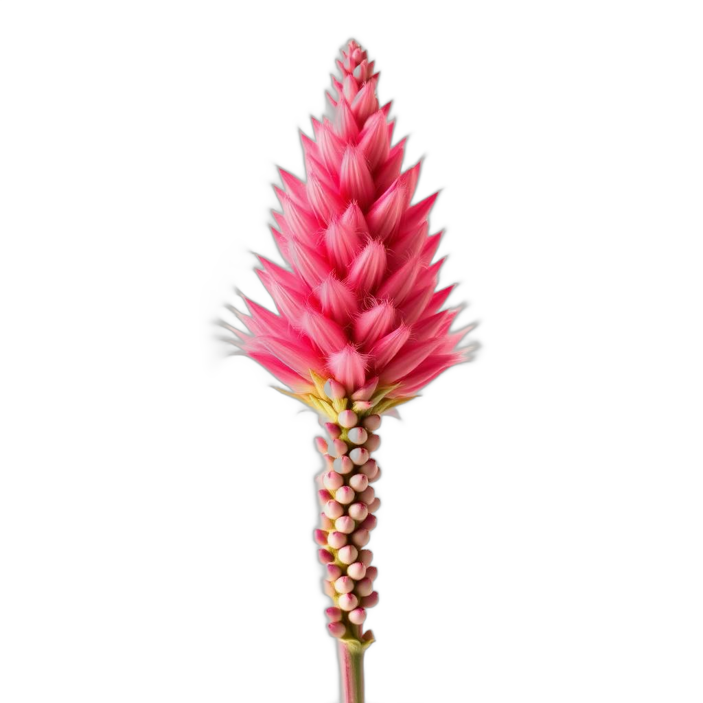

- _Celosia argentea_
- Role: upright · Type: seed · Weeks to bloom: 11
- Zones: 4, 5-6, 7, 8, 9-10
- Seasons: spring, summer, autumn
- Moods: joyful, apothecary, moody
- Sun: Full sun
- Watering: Moderate; well-draining soil preferred
- Indoor notes: Start indoors 10–12 weeks before last frost. Needs warmth to germinate.
- Bloom duration: 10–12 weeks
- Feathery plumes of braided color that bring sculptural drama to any basket.

---

## 2. Verbena

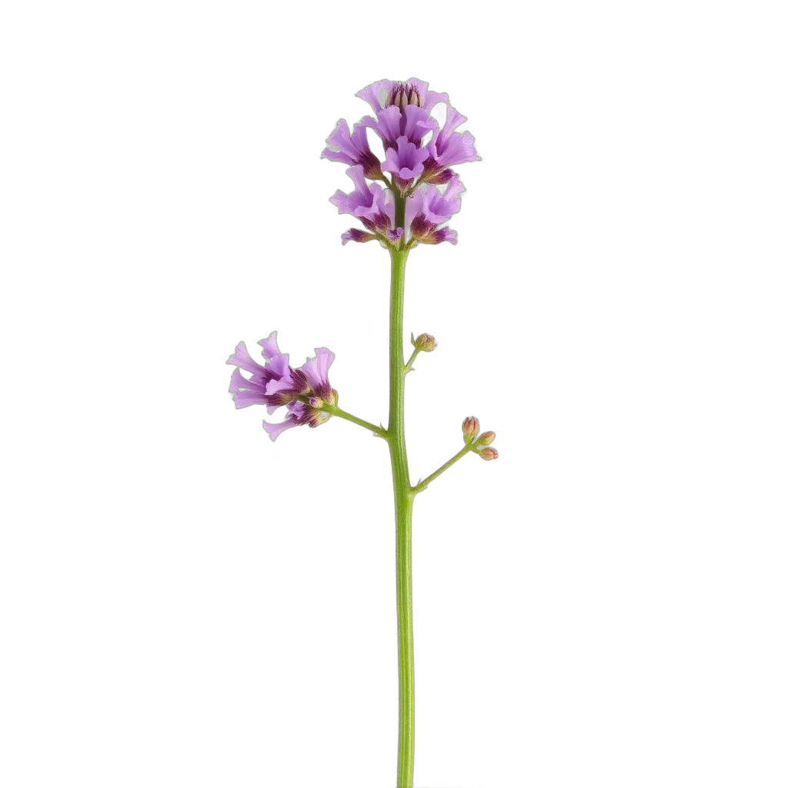

- _Verbena bonariensis_
- Role: upright · Type: seed · Weeks to bloom: 14
- Zones: 5-6, 7, 8, 9-10
- Seasons: spring, summer, autumn
- Moods: pollinator, wild, moody
- Sun: Full sun
- Watering: Moderate; good air circulation prevents disease
- Indoor notes: Start indoors 12–14 weeks before last frost. Chill seeds 1 week before sowing.
- Bloom duration: All season
- Tall airy purple clusters that sway in the breeze and bring butterflies by the dozen.

---

## 3. Zinnia Double Zahara™ Fire

- _Zinnia elegans_
- Role: mounder · Type: seed · Weeks to bloom: 9
- Zones: 4, 5-6, 7, 8, 9-10
- Seasons: spring, summer, autumn
- Moods: joyful, wild
- Sun: Full sun
- Watering: Moderate; water at base to prevent mildew
- Indoor notes: Start indoors 4–6 weeks before last frost. Germinates in 5–7 days.
- Bloom duration: All season
- Double blooms of fiery orange that blaze through summer without a single skip.

---

## 4. Portulaca Happy Trails™

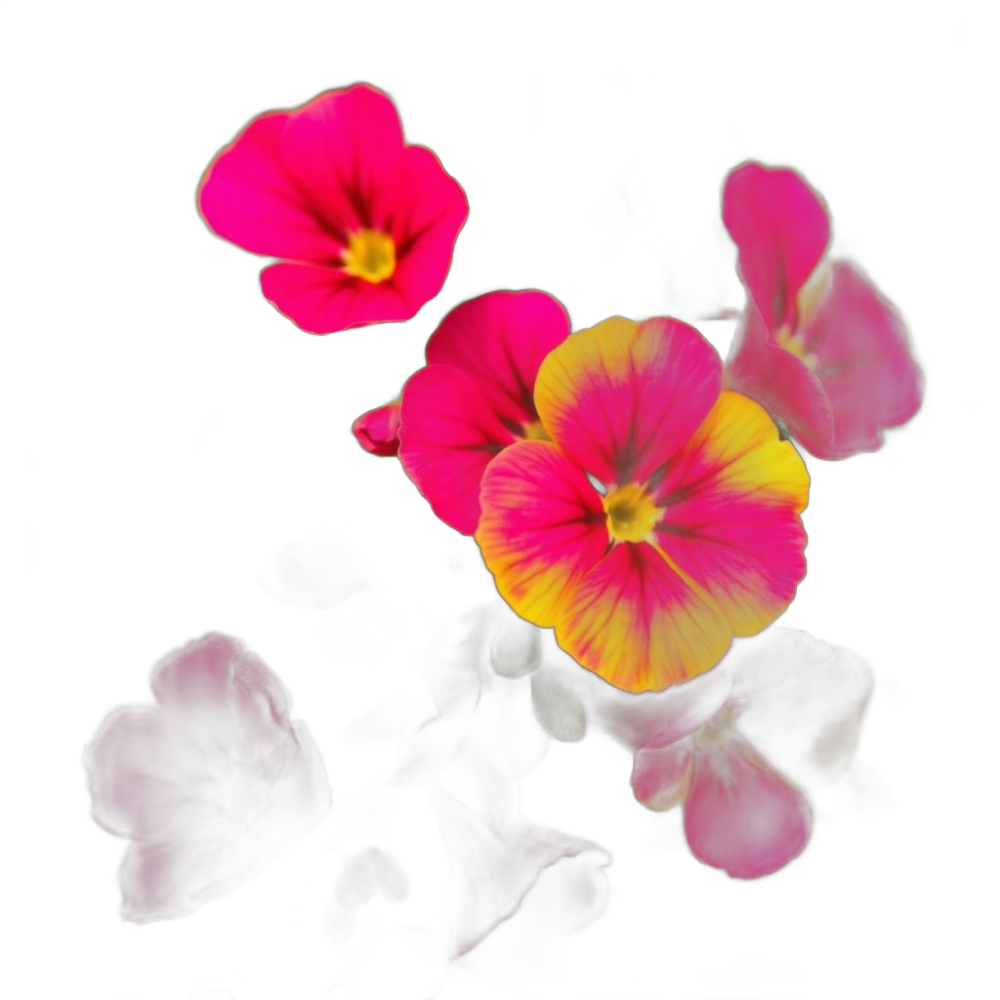

- _Portulaca grandiflora_
- Role: trailer · Type: seed · Weeks to bloom: 9
- Zones: 4, 5-6, 7, 8, 9-10
- Seasons: spring, summer, autumn
- Moods: joyful, wild
- Sun: Full sun; loves heat
- Watering: Low; extremely drought tolerant
- Indoor notes: Start indoors 6–8 weeks before last frost. Needs warmth to germinate.
- Bloom duration: All season
- Silky jewel-bright blooms that trail and tumble and practically glow in the afternoon sun.

---

## 5. Gomphrena Sequin

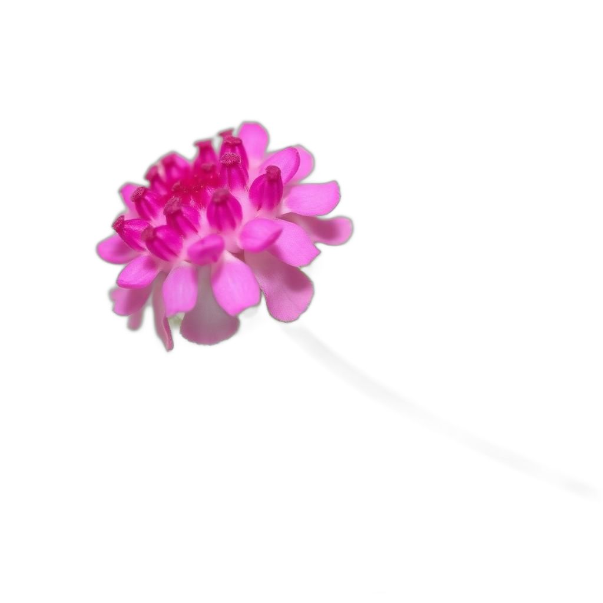

- _Gomphrena globosa_
- Role: mounder · Type: seed · Weeks to bloom: 11
- Zones: 5-6, 7, 8, 9-10
- Seasons: spring, summer, autumn
- Moods: pollinator, romantic, apothecary
- Sun: Full sun
- Watering: Low to moderate; very drought tolerant
- Indoor notes: Start indoors 6–8 weeks before last frost.
- Bloom duration: 12–14 weeks
- Button-round blooms in shimmering tones that hold their color long after cutting.

---

## 6. Petunia Easy Wave® Burgundy Velour

- _Petunia × hybrida_
- Role: trailer · Type: seed · Weeks to bloom: 11
- Zones: 4, 5-6, 7, 8, 9-10
- Seasons: spring, summer, autumn
- Moods: moody, romantic
- Sun: Full sun
- Watering: Regular; deadhead spent blooms to extend flowering
- Indoor notes: Start indoors 10–12 weeks before last frost. Tiny pelleted seeds — surface sow.
- Bloom duration: All season
- Deep burgundy velvet waves that spill dramatically over the basket edge all season long.

---

## 7. Petunia Easy Wave® Blue

- _Petunia × hybrida_
- Role: trailer · Type: seed · Weeks to bloom: 11
- Zones: 4, 5-6, 7, 8, 9-10
- Seasons: spring, summer, autumn
- Moods: moody, pollinator, romantic
- Sun: Full sun
- Watering: Regular; deadhead spent blooms to extend flowering
- Indoor notes: Start indoors 10–12 weeks before last frost. Tiny pelleted seeds — surface sow.
- Bloom duration: All season
- Cool blue-violet waves that cascade freely and bloom from spring until the first frost.

---

## 8. Salvia Victoria Blue

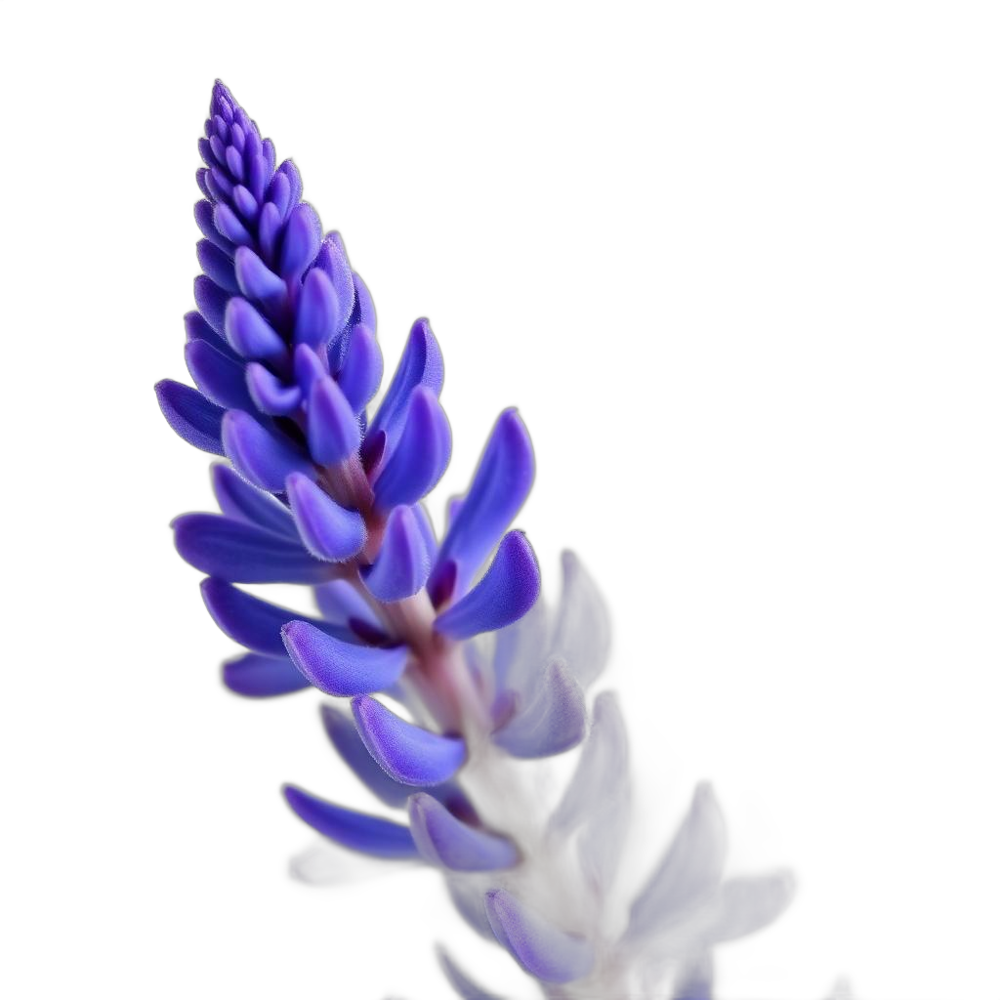

- _Salvia farinacea_
- Role: upright · Type: seed · Weeks to bloom: 13
- Zones: 4, 5-6, 7, 8, 9-10
- Seasons: spring, summer, autumn
- Moods: pollinator, moody
- Sun: Full sun
- Watering: Moderate; drought tolerant once established
- Indoor notes: Start indoors 12–14 weeks before last frost.
- Bloom duration: All season
- Stately spikes of true blue that hummingbirds and bees simply cannot resist.

---

## 9. Sweet Alyssum

- _Lobularia maritima_
- Role: trailer · Type: seed · Weeks to bloom: 7
- Zones: 4, 5-6, 7, 8, 9-10
- Seasons: spring, summer, autumn
- Moods: pollinator, romantic, apothecary, wild
- Sun: Full sun to partial shade
- Watering: Moderate; shear back mid-season to refresh blooms
- Indoor notes: Start indoors 6–8 weeks before last frost. Surface sow — needs light to germinate.
- Bloom duration: All season
- Clouds of honey-scented tiny flowers that fill the air with sweetness all season long.

---

## 10. Impatiens Beacon Mix

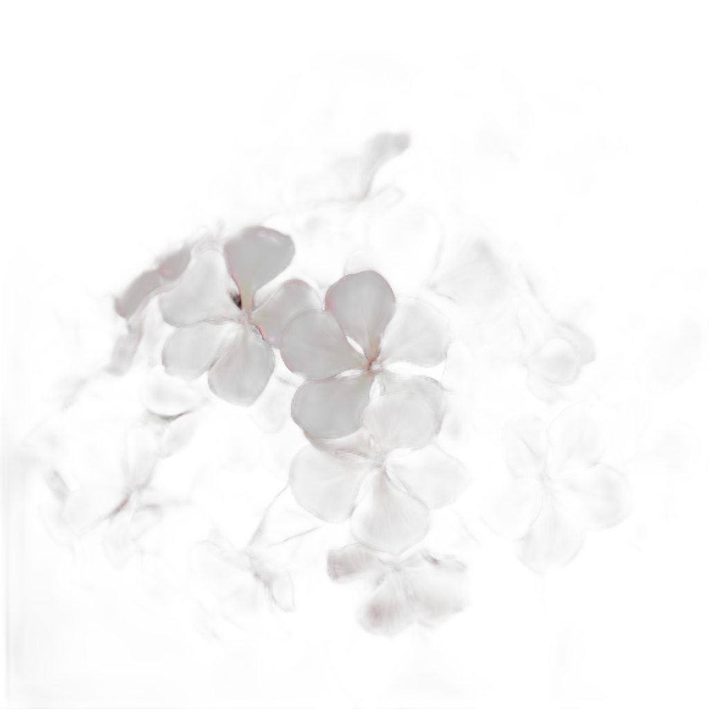

- _Impatiens walleriana_
- Role: mounder · Type: seed · Weeks to bloom: 11
- Zones: 4, 5-6, 7, 8, 9-10
- Seasons: spring, summer, autumn
- Moods: romantic, joyful
- Sun: Partial shade to shade
- Watering: Keep consistently moist; wilts quickly when dry
- Indoor notes: Start indoors 10–12 weeks before last frost. Needs warmth and light to germinate.
- Bloom duration: All season
- Cheerful mixed-color mounds that thrive in the shade and never skip a beat.

---

## 11. Impatiens Beacon Coral

- _Impatiens walleriana_
- Role: mounder · Type: seed · Weeks to bloom: 11
- Zones: 4, 5-6, 7, 8, 9-10
- Seasons: spring, summer, autumn
- Moods: romantic, joyful
- Sun: Partial shade to shade
- Watering: Keep consistently moist; wilts quickly when dry
- Indoor notes: Start indoors 10–12 weeks before last frost. Needs warmth and light to germinate.
- Bloom duration: All season
- Warm coral blooms that glow like sunset light filtering through summer leaves.

---

## 12. Lobelia Starship Rose

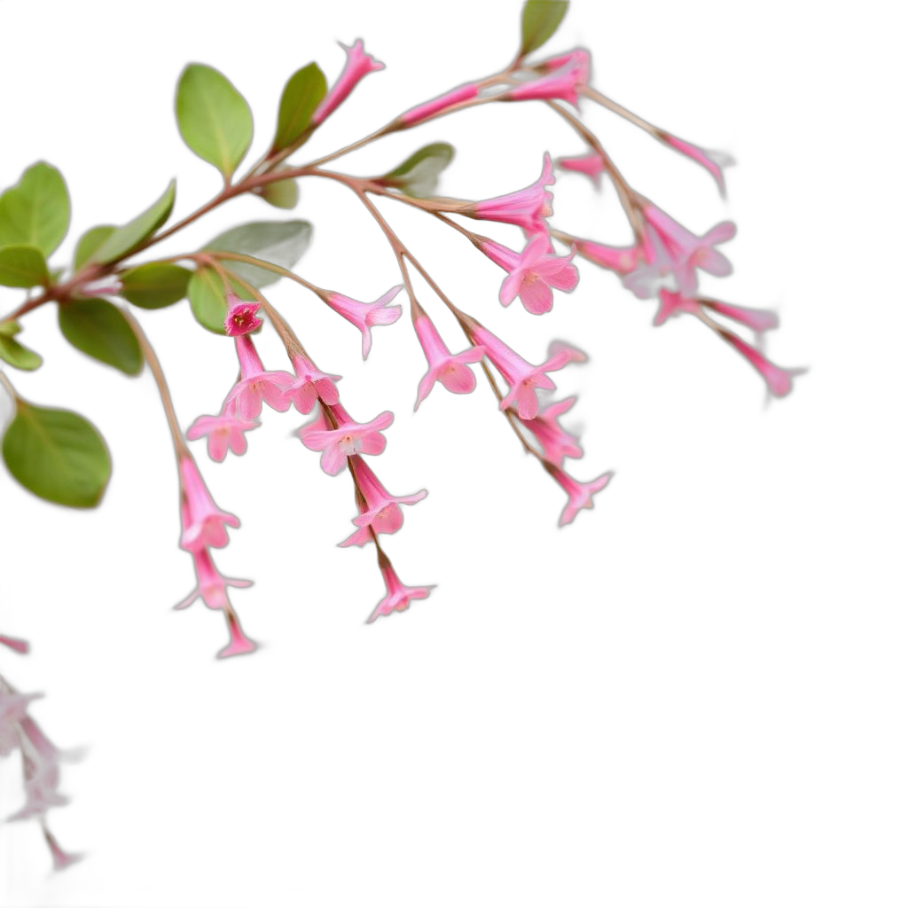

- _Lobelia erinus_
- Role: trailer · Type: seed · Weeks to bloom: 13
- Zones: 4, 5-6, 7, 8, 9-10
- Seasons: spring, summer, autumn
- Moods: romantic, pollinator
- Sun: Full sun to partial shade
- Watering: Keep moist; heat sensitive — water regularly in summer
- Indoor notes: Start indoors 12–14 weeks before last frost. Tiny seeds — surface sow.
- Bloom duration: 10–12 weeks
- Delicate rose-pink cascades that soften any basket with a gentle trailing grace.

---

## 13. Lobelia Scarlet Bronze Leaf

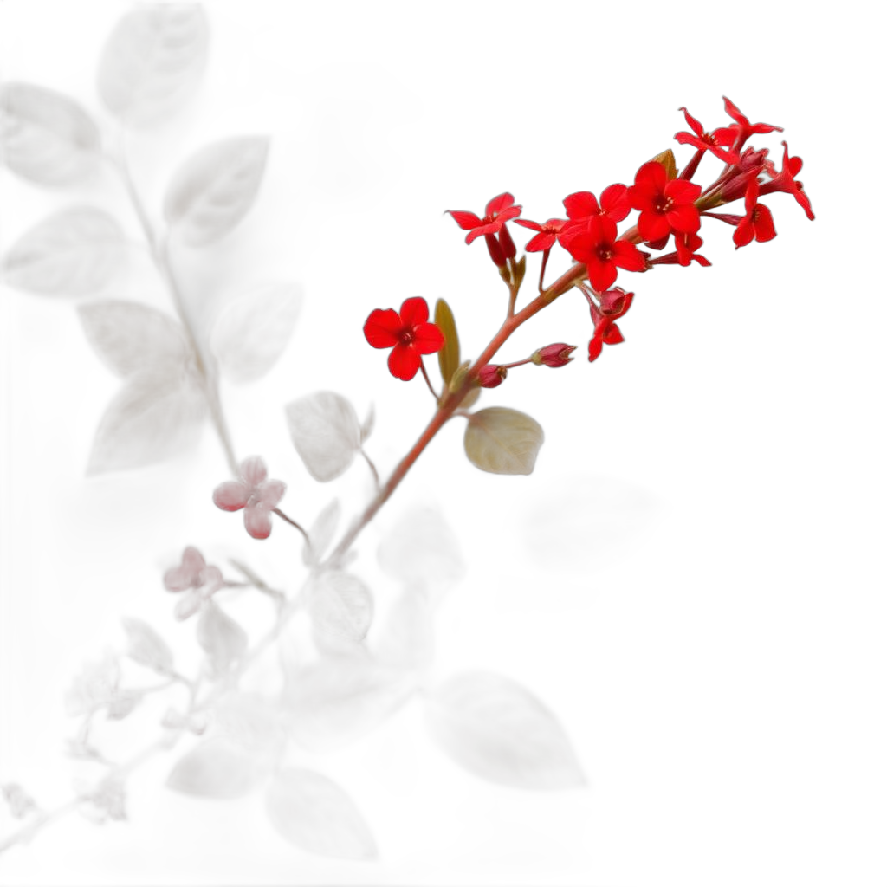

- _Lobelia erinus_
- Role: trailer · Type: seed · Weeks to bloom: 13
- Zones: 4, 5-6, 7, 8, 9-10
- Seasons: spring, summer, autumn
- Moods: moody, wild
- Sun: Full sun to partial shade
- Watering: Keep moist; heat sensitive
- Indoor notes: Start indoors 12–14 weeks before last frost. Tiny seeds — surface sow.
- Bloom duration: 10–12 weeks
- Fiery scarlet blooms set against rich bronze foliage for a striking, moody contrast.

---

## 14. Lobelia Palace White

- _Lobelia erinus_
- Role: trailer · Type: seed · Weeks to bloom: 13
- Zones: 4, 5-6, 7, 8, 9-10
- Seasons: spring, summer, autumn
- Moods: romantic, apothecary
- Sun: Full sun to partial shade
- Watering: Keep moist; heat sensitive
- Indoor notes: Start indoors 12–14 weeks before last frost. Tiny seeds — surface sow.
- Bloom duration: 10–12 weeks
- Pure white sprays that spill like a waterfall and bring airy lightness to any combination.

---

## 15. Statice Twilight

- _Limonium sinuatum_
- Role: upright · Type: seed · Weeks to bloom: 11
- Zones: 4, 5-6, 7, 8, 9-10
- Seasons: spring, summer, autumn
- Moods: moody, apothecary
- Sun: Full sun
- Watering: Low; drought tolerant; excellent dried flower
- Indoor notes: Start indoors 10–12 weeks before last frost.
- Bloom duration: 10–12 weeks
- Deep purple-blue papery clusters that dry beautifully on the stem and hold color for months.

---

## 16. Statice Apricot Beauty

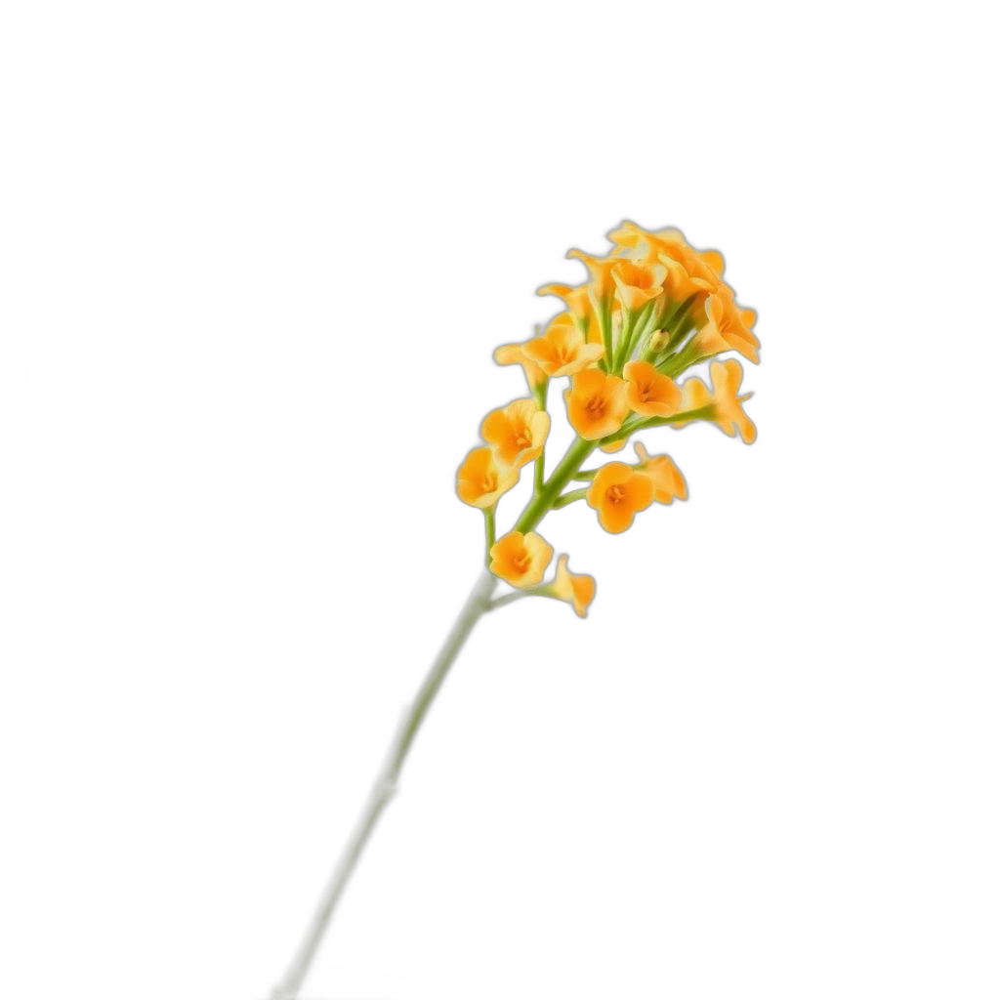

- _Limonium sinuatum_
- Role: upright · Type: seed · Weeks to bloom: 11
- Zones: 4, 5-6, 7, 8, 9-10
- Seasons: spring, summer, autumn
- Moods: romantic, apothecary
- Sun: Full sun
- Watering: Low; drought tolerant
- Indoor notes: Start indoors 10–12 weeks before last frost.
- Bloom duration: 10–12 weeks
- Warm apricot papery blooms with an heirloom charm that linger long after the season ends.

---

## 17. Statice Pastel Mix

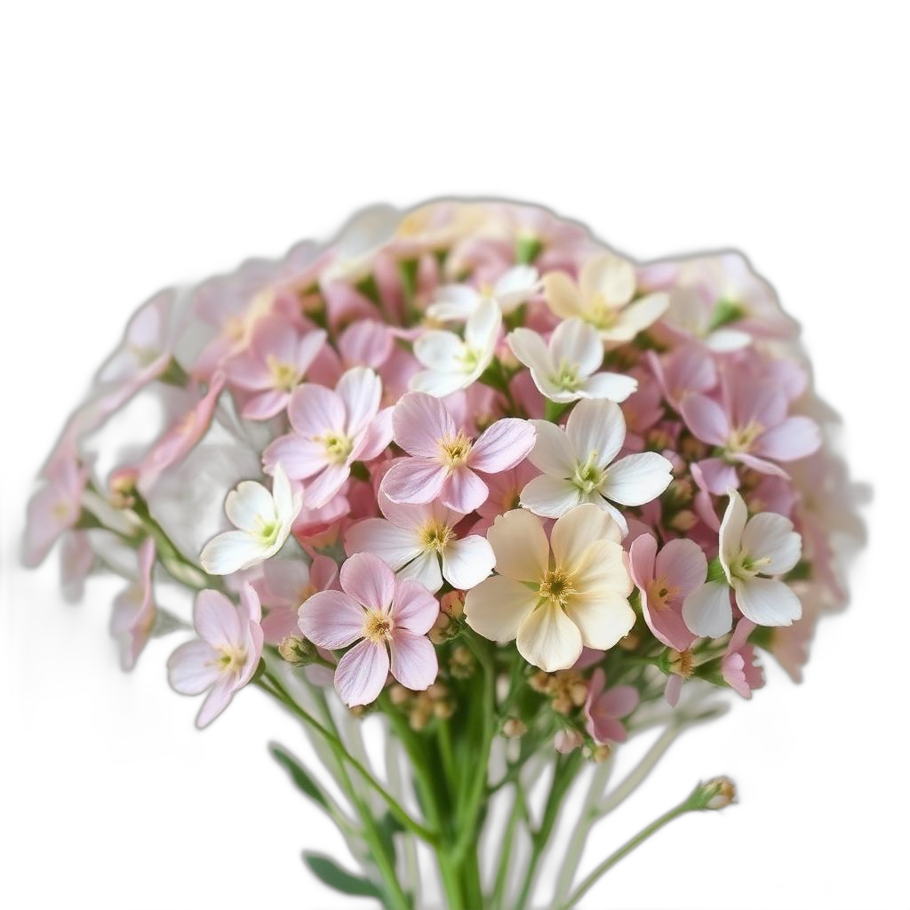

- _Limonium sinuatum_
- Role: upright · Type: seed · Weeks to bloom: 11
- Zones: 4, 5-6, 7, 8, 9-10
- Seasons: spring, summer, autumn
- Moods: romantic, apothecary, pollinator
- Sun: Full sun
- Watering: Low; drought tolerant
- Indoor notes: Start indoors 10–12 weeks before last frost.
- Bloom duration: 10–12 weeks
- A soft medley of blush, lavender, and cream that evokes pressed flowers and quiet afternoons.

---

## 18. Annual Phlox Dwarf Mix

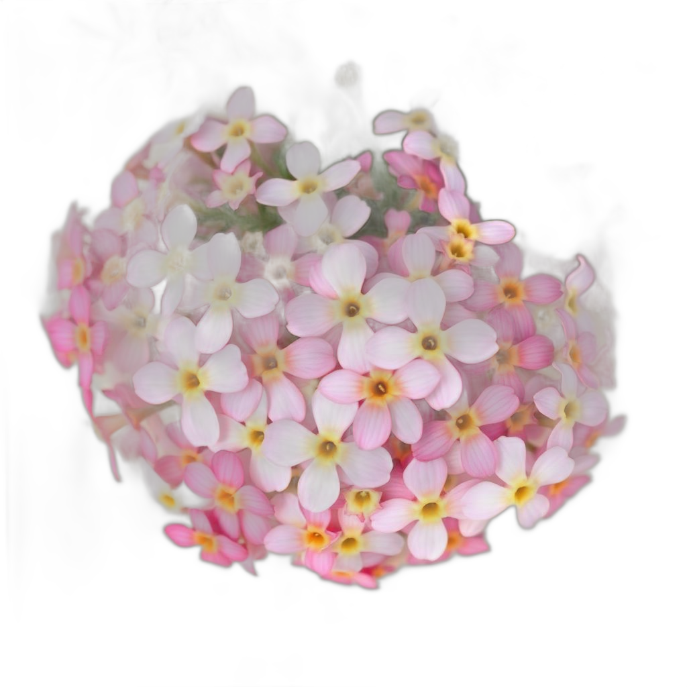

- _Phlox drummondii_
- Role: mounder · Type: seed · Weeks to bloom: 9
- Zones: 4, 5-6, 7, 8, 9-10
- Seasons: spring, summer
- Moods: joyful, romantic, pollinator
- Sun: Full sun
- Watering: Moderate; good air circulation prevents mildew
- Indoor notes: Start indoors 6–8 weeks before last frost.
- Bloom duration: 8–10 weeks
- A confetti of cheerful star-shaped blooms in every pastel and bright shade imaginable.

---

## 19. Cosmos Dwarf Early Rose

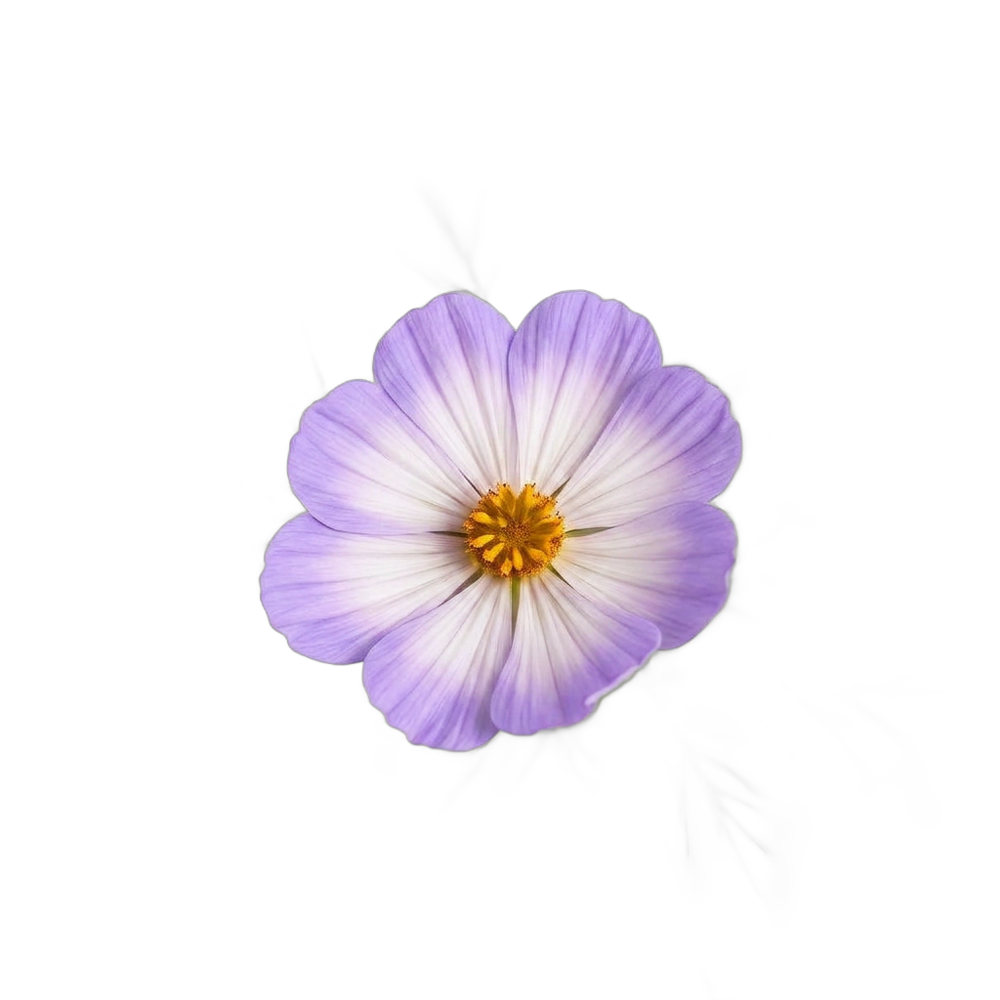

- _Cosmos bipinnatus_
- Role: mounder · Type: seed · Weeks to bloom: 9
- Zones: 4, 5-6, 7, 8, 9-10
- Seasons: spring, summer
- Moods: wild, pollinator, romantic
- Sun: Full sun
- Watering: Low to moderate; drought tolerant
- Indoor notes: Start indoors 6–8 weeks before last frost.
- Bloom duration: 10–12 weeks
- Feathery foliage topped with silky rose-pink discs that dance in every passing breeze.

---

## 20. Strawflower King Size Orange

- _Bracteantha bracteata_
- Role: mounder · Type: seed · Weeks to bloom: 9
- Zones: 5-6, 7, 8, 9-10
- Seasons: spring, summer, autumn
- Moods: apothecary, joyful, wild
- Sun: Full sun
- Watering: Low; prefers dry conditions
- Indoor notes: Start indoors 6–8 weeks before last frost.
- Bloom duration: All season
- Papery petals of vivid orange that seem to hold the warmth of summer long after picking.

---

## 21. Gomphrena Strawberry Fair

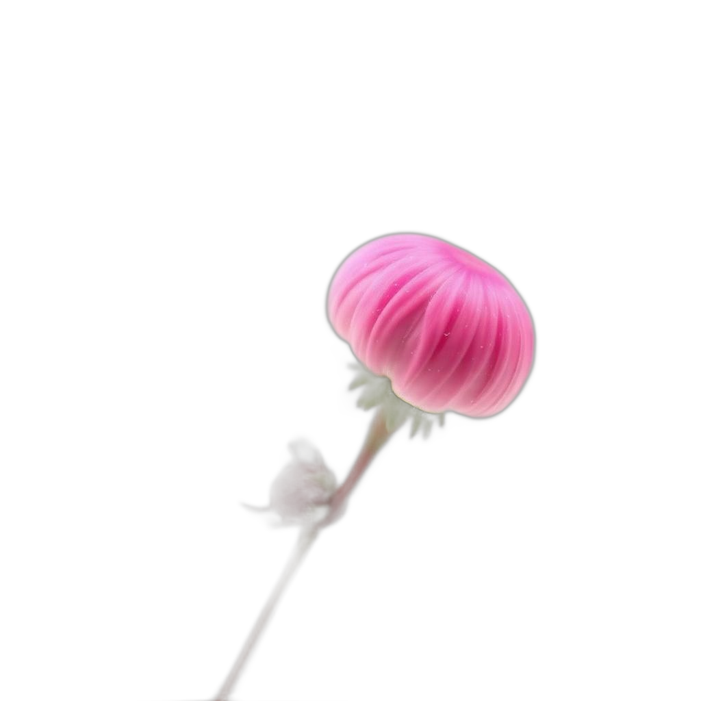

- _Gomphrena globosa_
- Role: mounder · Type: seed · Weeks to bloom: 11
- Zones: 5-6, 7, 8, 9-10
- Seasons: spring, summer, autumn
- Moods: pollinator, romantic, joyful
- Sun: Full sun
- Watering: Low to moderate; very drought tolerant
- Indoor notes: Start indoors 6–8 weeks before last frost.
- Bloom duration: 12–14 weeks
- Strawberry-pink clover-like blooms that pollinators adore and summer heat cannot fade.

---

## 22. Zinnia Linearis Mix

- _Zinnia haageana_
- Role: mounder · Type: seed · Weeks to bloom: 8
- Zones: 4, 5-6, 7, 8, 9-10
- Seasons: spring, summer, autumn
- Moods: joyful, wild, pollinator
- Sun: Full sun
- Watering: Moderate; water at base to prevent mildew
- Indoor notes: Start indoors 4–6 weeks before last frost. Germinates quickly.
- Bloom duration: All season
- Narrow-petaled single blooms in a cheerful mix — elegant, wildflower-loose, and beloved by bees.

---

## 23. Daisy Shasta

- _Leucanthemum × superbum_
- Role: upright · Type: seed · Weeks to bloom: 11
- Zones: 4, 5-6, 7, 8, 9-10
- Seasons: spring, summer
- Moods: romantic, pollinator, apothecary
- Sun: Full sun
- Watering: Moderate; deadhead to prolong blooming
- Indoor notes: Start indoors 8–10 weeks before last frost.
- Bloom duration: 8–10 weeks
- Classic white petals with sunny yellow centers — cheerful, timeless, and beloved by all.

---

## 24. Daisy Ice Plant Livingstone Pastel

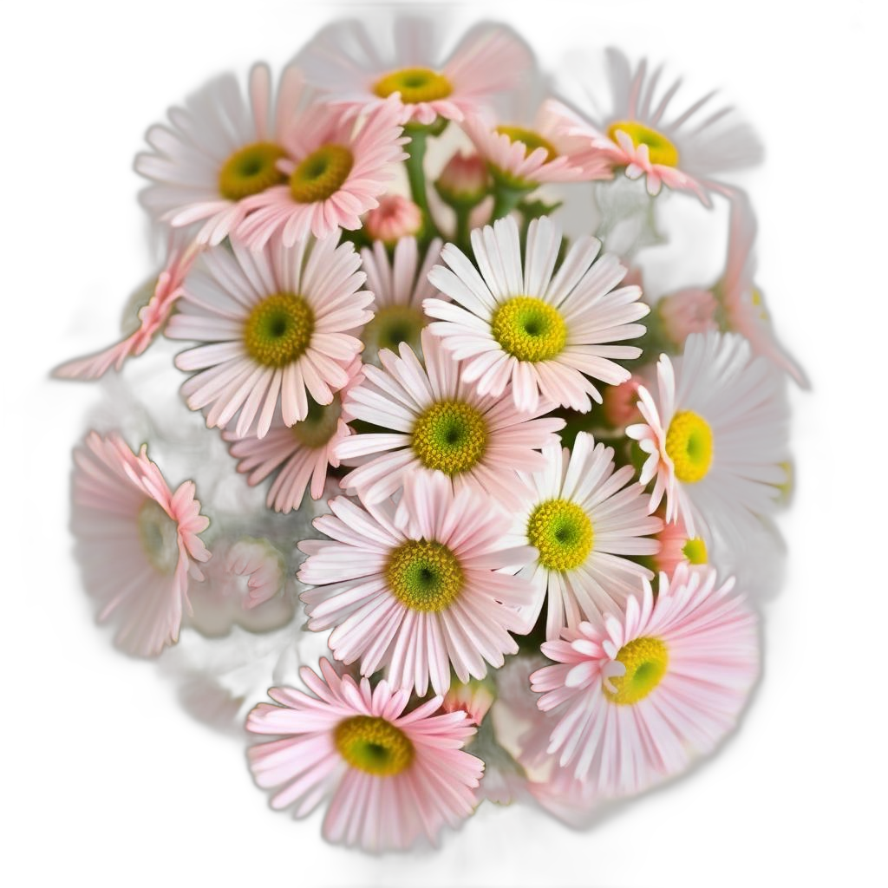

- _Mesembryanthemum criniflorum_
- Role: mounder · Type: seed · Weeks to bloom: 9
- Zones: 7, 8, 9-10
- Seasons: spring, summer, autumn
- Moods: joyful, romantic, wild
- Sun: Full sun; loves heat and drought
- Watering: Low; extremely drought tolerant
- Indoor notes: Start indoors 6–8 weeks before last frost.
- Bloom duration: 10–12 weeks
- Shimmering pastel daisies that open wide in the sun like little jewels catching the light.

---

## 25. Daisy Painted Rainbow Mix

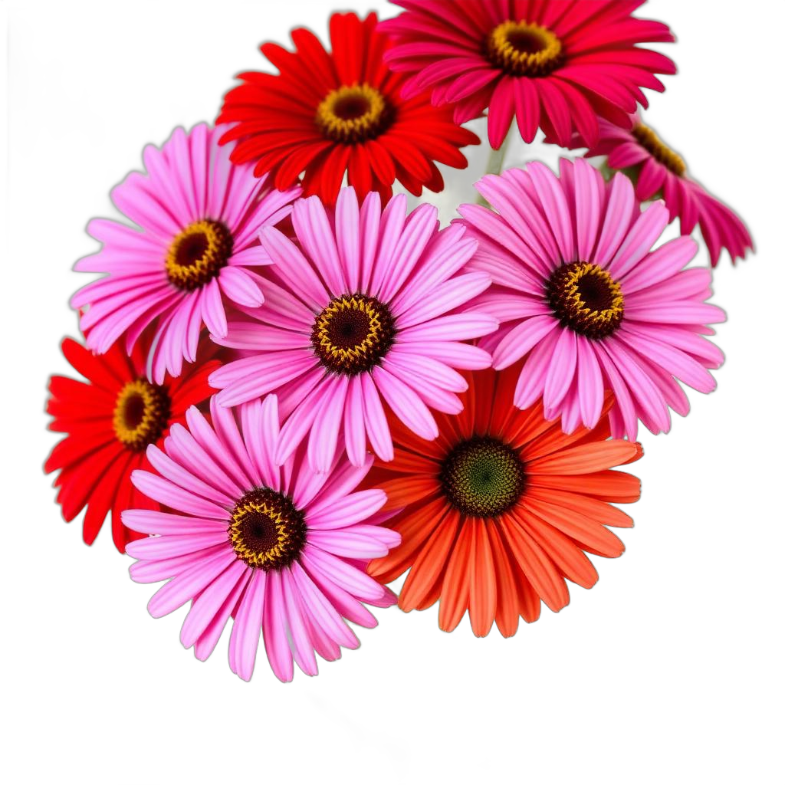

- _Chrysanthemum carinatum_
- Role: mounder · Type: seed · Weeks to bloom: 9
- Zones: 4, 5-6, 7, 8, 9-10
- Seasons: spring, summer
- Moods: wild, joyful, pollinator
- Sun: Full sun
- Watering: Moderate; good drainage essential
- Indoor notes: Start indoors 6–8 weeks before last frost.
- Bloom duration: 8–10 weeks
- Bold rings of contrasting color on each petal give these daisies an almost kaleidoscopic beauty.

---

## 26. Snapdragon Twinny Peach

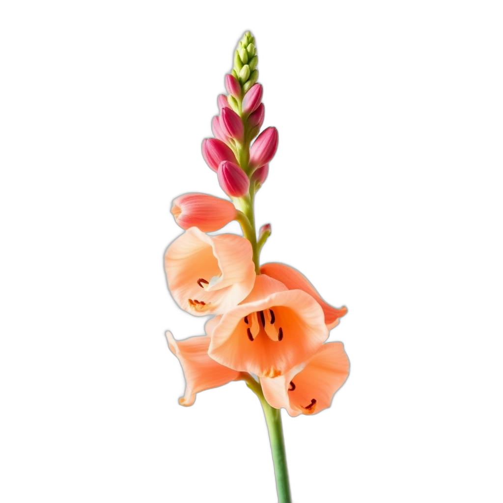

- _Antirrhinum majus_
- Role: upright · Type: seed · Weeks to bloom: 13
- Zones: 4, 5-6, 7, 8, 9-10
- Seasons: spring, autumn
- Moods: romantic, apothecary, joyful
- Sun: Full sun to partial shade
- Watering: Moderate; avoid wetting foliage
- Indoor notes: Start indoors 12–14 weeks before last frost. Light needed for germination.
- Bloom duration: 8–10 weeks
- Soft peach double blooms with a honey fragrance that bring a vintage cottage feeling to any basket.

---

## 27. Morning Glory Heavenly Blue

- _Ipomoea tricolor_
- Role: trailer · Type: seed · Weeks to bloom: 10
- Zones: 5-6, 7, 8, 9-10
- Seasons: spring, summer, autumn
- Moods: moody, romantic, pollinator
- Sun: Full sun
- Watering: Moderate
- Indoor notes: Start indoors 4–6 weeks before last frost; nick seeds and soak overnight.
- Bloom duration: All season
- Sky-blue trumpets that open each morning and trail dramatically over basket edges.

---

## 28. Morning Glory Grandpa Ott (Purple)

- _Ipomoea purpurea_
- Role: trailer · Type: seed · Weeks to bloom: 10
- Zones: 4, 5-6, 7, 8, 9-10
- Seasons: spring, summer, autumn
- Moods: moody, romantic, apothecary
- Sun: Full sun
- Watering: Moderate
- Indoor notes: Start indoors 4–6 weeks before last frost; soak seeds overnight.
- Bloom duration: All season
- Deep velvety purple trumpets with a star at the throat — heirloom favorite.

---

## 29. Morning Glory Scarlet O'Hara (Pink)

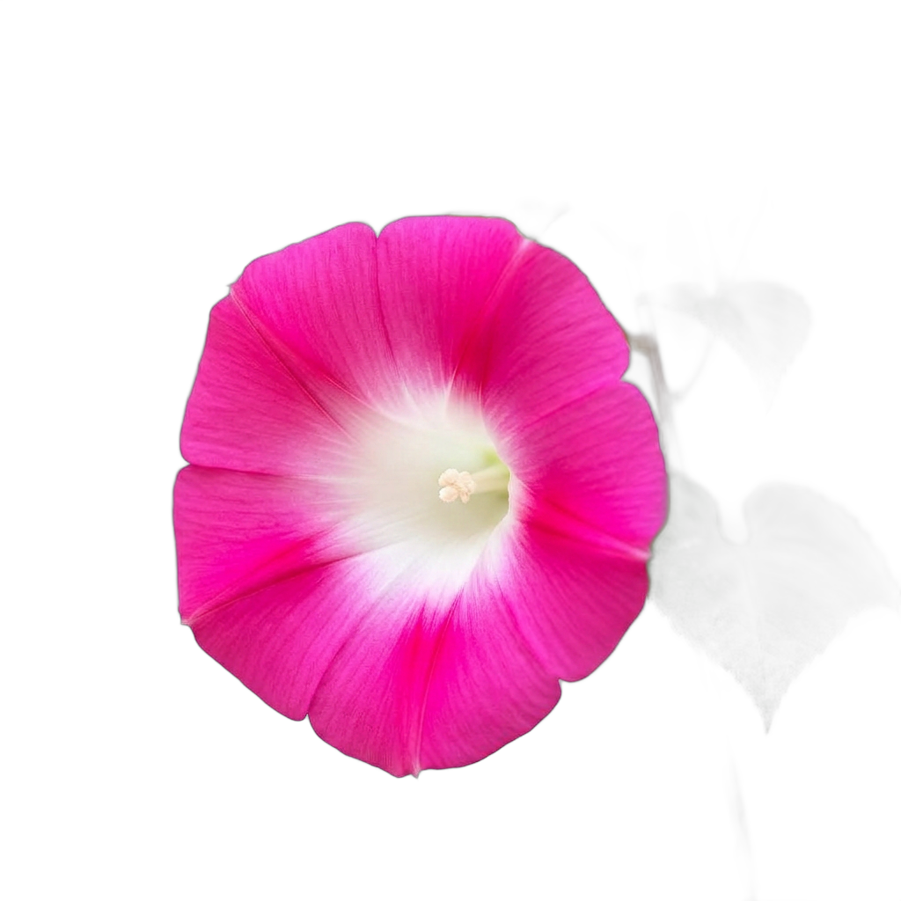

- _Ipomoea purpurea_
- Role: trailer · Type: seed · Weeks to bloom: 10
- Zones: 5-6, 7, 8, 9-10
- Seasons: spring, summer
- Moods: romantic, joyful, pollinator
- Sun: Full sun
- Watering: Moderate
- Indoor notes: Start indoors 4–6 weeks before last frost; soak overnight.
- Bloom duration: All season
- Soft rose-pink blooms streaked with white, tumbling in a romantic cascade.

---

## 30. Morning Glory Pearly Gates (White)

- _Ipomoea tricolor_
- Role: trailer · Type: seed · Weeks to bloom: 10
- Zones: 5-6, 7, 8, 9-10
- Seasons: spring, summer, autumn
- Moods: romantic, apothecary
- Sun: Full sun
- Watering: Moderate
- Indoor notes: Start indoors 4–6 weeks before last frost; soak overnight.
- Bloom duration: All season
- Pure white trumpets that glow at dawn and dusk — luminous and serene.

---

## 31. Marigold Yellow (Petite Gold)

- _Tagetes patula_
- Role: mounder · Type: seed · Weeks to bloom: 8
- Zones: 4, 5-6, 7, 8, 9-10
- Seasons: spring, summer, autumn
- Moods: joyful, pollinator, wild, apothecary
- Sun: Full sun
- Watering: Low to moderate; drought tolerant once established
- Indoor notes: Start indoors 6–8 weeks before last frost, or direct sow after frost.
- Bloom duration: All season
- Sunny golden-yellow pompoms that pump out blooms nonstop and repel garden pests.
